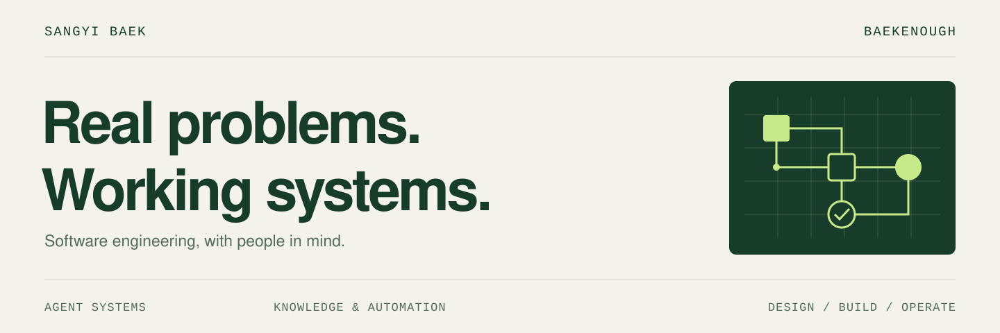

<picture>
  <source media="(prefers-color-scheme: dark)" srcset="./assets/profile/hero-dark.svg">
  
</picture>

 

**백상이 · 소프트웨어 엔지니어**

복잡한 현장의 문제를, 사람들이 쓸 수 있는 소프트웨어로 만듭니다.
의료 소프트웨어의 시스템 연동·운영 경험을 바탕으로 **AI 에이전트, 지식관리 시스템, 개발 자동화 도구**를 설계하고 개발합니다.
문제를 발견하는 일부터 구현, 검증, 배포 이후의 운영까지 직접 연결하는 일을 좋아합니다.

[포트폴리오](https://portfolio.baekenough.com/) &nbsp; / &nbsp; [링크드인](https://www.linkedin.com/in/sangyi-baek-a8b028203/) &nbsp; / &nbsp; [이메일](mailto:baekenough@gmail.com)

 

## 지금 하는 일

**애자일소다 · 수석 연구원** &nbsp; 2026.05 — 현재 
AgentX 1팀 · AX Dev Chapter 리드

- **사내 AX와 지식관리** — 업무 데이터 수집·정제, RAG 기반 검색·질의응답, 프로젝트 현황·리스크 관리 서비스를 기획하고 개발합니다.
- **공기업 AX 프로젝트 PL** — 고객 요구사항 분석, AI 에이전트 플랫폼 커스터마이징, 폐쇄망 배포 환경 구성과 기술지원을 수행합니다. 바이브 코딩·하네스 엔지니어링 교육도 진행합니다.
- **에이전트 개발·운영 기반** — FastAPI·LangChain·LangGraph 기반 실행 환경, 로깅·관측성, Kubernetes 배포와 개발 도구를 개선합니다.

 

## 대표 프로젝트

<table>
  <tr>
    <td width="50%" valign="top">
      
      <h3><a href="https://github.com/baekenough/oh-my-customcode">oh-my-customcode ↗</a></h3>
      
<strong>AI 코딩을 반복 가능한 개발 과정으로.</strong>

      
스킬·전문 에이전트·라우팅·검증 규칙을 엮어 개발 과정을 표준화하는 Claude Code 하네스.

      
<code>TypeScript</code> <code>Claude Code</code> <code>npm</code>

    </td>
    <td width="50%" valign="top">
      
      <h3><a href="https://github.com/baekenough/second-brain">second-brain ↗</a></h3>
      
<strong>흩어진 기록을, 다시 쓸 수 있는 지식으로.</strong>

      
문서·Slack·GitHub·메일을 수집하고 하이브리드 검색·LLM 큐레이션·MCP로 연결하는 프라이빗 검색 엔진.

      
<code>Go</code> <code>PostgreSQL</code> <code>pgvector</code> <code>MCP</code>

    </td>
  </tr>
</table>

**그 밖의 도구**

- [**baekenough-skills**](https://github.com/baekenough/baekenough-skills) — 다중 LLM 검토, CLI 실행, YAML 파이프라인 등 재사용 가능한 에이전트 스킬 모음.
- [**workspace-brain**](https://github.com/baekenough/workspace-brain) — 프로젝트별 지식 격리와 공통 RAG 인터페이스를 탐구하는 Go 프로토타입. Slack·HTTP 어댑터와 로컬 검색 코어를 구현했습니다.

이전 프로젝트와 실험

 

| 프로젝트 | 다룬 문제 |
|:---|:---|
| [oh-my-customcodex](https://github.com/baekenough/oh-my-customcodex) · 보관 | Claude Code 하네스를 Codex 환경에 맞게 이식 |
| [AIMS](https://github.com/baekenough/aims) · 보관 | 멀티테넌트 AI 에이전트 생성·배포·오케스트레이션 |
| [customclaw](https://github.com/baekenough/customclaw) · 보관 | Claude·Codex 기반 여러 AI 봇의 통합 운영 |
| [clau-doom](https://github.com/baekenough/clau-doom) · 연구 종료 | LLM 오케스트레이션, RAG와 실험계획법을 이용한 DOOM 에이전트 연구 |

 

## 개발 방식

**문제 정의 → 설계 → 구현 → 검증 → 운영**

Claude Code와 Codex를 실제 개발 과정에 사용합니다.
에이전트의 역할·맥락·도구를 정하고, 코드 검토·회귀 테스트·작업 인계까지 이어지는 흐름을 구성합니다.
자동화한 결과를 확인하고 다음 작업에서 재사용할 수 있도록 남기는 것까지 개발의 일부로 봅니다.

| 영역 | 주로 사용하는 기술 |
|:---|:---|
| 언어 | Python · Go · TypeScript |
| 애플리케이션 | FastAPI · React · Next.js |
| AI·데이터 | LangChain · LangGraph · MCP · PostgreSQL · pgvector · ClickHouse · Redis |
| 배포·운영 | Docker · Kubernetes · Helm · GitHub Actions · AWS · Linux |

 

## 이전 경력

2018년부터 의료 소프트웨어의 기술지원, 시스템 연동, 배포 자동화를 경험해 왔습니다.
현장의 제약을 이해하고, 실제 운영까지 이어지는 구조를 만드는 데 이 경험을 활용합니다.

| 기간 | 회사 · 주요 업무 |
|:---|:---|
| 2025.02 — 2026.02 | **메디웨일** · 고객별 인터페이스 서버, PyQt 애플리케이션, 배포·업데이트 자동화 |
| 2022.07 — 2025.01 | **뷰노** · EMR ↔ AI 서버 연동, 데이터 처리, 온프레미스 배포·기술지원 |
| 2021.02 — 2022.07 | **에이치디정션** · 데이터 마이그레이션, 외부 시스템 연동, QA 프로세스 정비 |

 

---

사람을 향하는 엔지니어링. &nbsp; · &nbsp; <a href="mailto:baekenough@gmail.com">함께 이야기하기 ↗</a>
