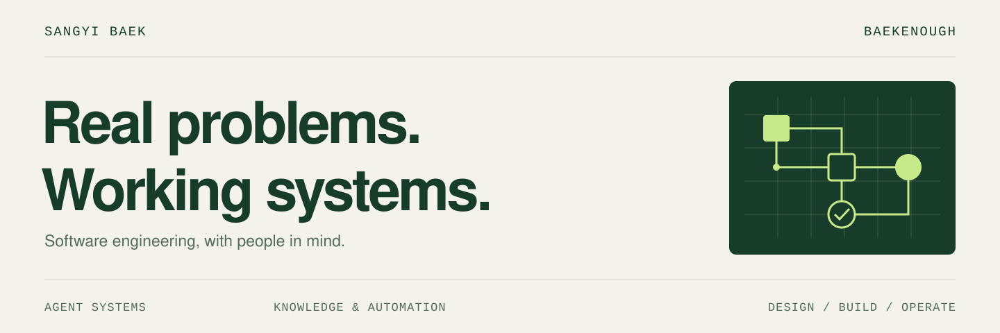
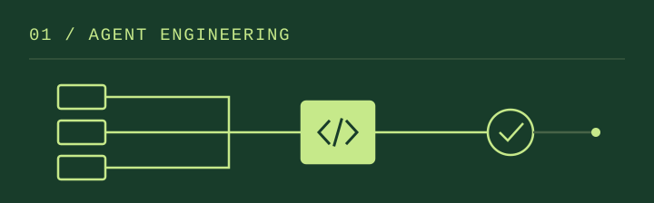
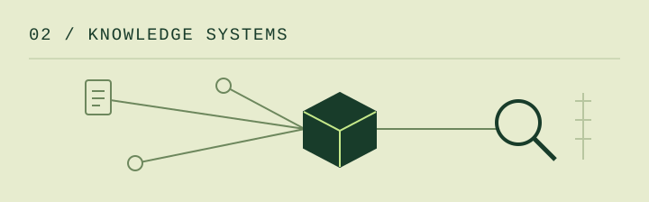

<a href="./README.md">한국어</a> &nbsp;·&nbsp; <strong>English</strong>

<picture>
  <source media="(prefers-color-scheme: dark)" srcset="./assets/profile/hero-en-dark.svg">
  
</picture>

 

**SangYi Baek · Software Engineer**

I turn complex problems in the field into software people can use.
My background in healthcare software integration and operations now informs my work on **AI agents, knowledge systems, and developer tools**.
I enjoy taking a problem from discovery through design, implementation, verification, and ongoing operation.

[Portfolio](https://portfolio.baekenough.com/) &nbsp; / &nbsp; [LinkedIn](https://www.linkedin.com/in/sangyi-baek-a8b028203/) &nbsp; / &nbsp; [Email](mailto:baekenough@gmail.com)

 

## Current work

**AgileSoDa · Principal Researcher** &nbsp; May 2026 — Present 
AgentX Team 1 · AX Dev Chapter Lead

- **Internal AX & knowledge systems** — Design and build data collection pipelines, RAG search and Q&A, and services for project visibility and risk management.
- **Public enterprise AX project lead** — Translate customer requirements into platform changes, support deployment in isolated networks, and resolve technical issues. Teach AI-assisted coding and harness engineering.
- **Agent development & operations** — Improve FastAPI, LangChain, and LangGraph runtimes, logging and observability, Kubernetes deployments, and developer tooling.

 

## Selected work

<table>
  <tr>
    <td width="50%" valign="top">
      
      <h3><a href="https://github.com/baekenough/oh-my-customcode">oh-my-customcode ↗</a></h3>
      
<strong>Make AI coding a repeatable process.</strong>

      
A Claude Code harness that connects reusable skills, specialist agents, routing, and verification.

      
<code>TypeScript</code> <code>Claude Code</code> <code>npm</code>

    </td>
    <td width="50%" valign="top">
      
      <h3><a href="https://github.com/baekenough/second-brain">second-brain ↗</a></h3>
      
<strong>Turn scattered records into useful knowledge.</strong>

      
Private search across documents, Slack, GitHub, and email, with hybrid retrieval, LLM curation, and MCP.

      
<code>Go</code> <code>PostgreSQL</code> <code>pgvector</code> <code>MCP</code>

    </td>
  </tr>
</table>

**More tools I build**

- [**baekenough-skills**](https://github.com/baekenough/baekenough-skills) — Reusable agent skills for multi-LLM reviews, CLI execution, and YAML workflows.
- [**workspace-brain**](https://github.com/baekenough/workspace-brain) — A Go prototype exploring tenant isolation and a shared RAG interface, with Slack and HTTP adapters and a local search core.

Earlier projects & experiments

 

| Project | Exploration |
|:---|:---|
| [oh-my-customcodex](https://github.com/baekenough/oh-my-customcodex) · Archived | Adapting the Claude Code harness to a Codex-native workflow |
| [AIMS](https://github.com/baekenough/aims) · Archived | Multi-tenant agent creation, deployment, and orchestration |
| [customclaw](https://github.com/baekenough/customclaw) · Archived | Operating multiple AI bots with Claude and Codex |
| [clau-doom](https://github.com/baekenough/clau-doom) · Research concluded | DOOM agents combining LLM orchestration, RAG, and design of experiments |

 

## Engineering practice

**Define → Design → Build → Verify → Operate**

I use Claude Code and Codex in daily development.
I define agent roles, context, and tools, then connect implementation to code review, regression checks, and handoff notes.
Verifying the result and preserving what the next task can reuse are part of the work.

| Area | Tools I work with |
|:---|:---|
| Languages | Python · Go · TypeScript |
| Applications | FastAPI · React · Next.js |
| Agents & data | LangChain · LangGraph · MCP · PostgreSQL · pgvector · ClickHouse · Redis |
| Delivery | Docker · Kubernetes · Helm · GitHub Actions · AWS · Linux |

 

## Background

Since 2018, I have worked across healthcare software support, system integration, and deployment automation.
That experience shapes how I account for real operating constraints and carry software into everyday use.

| Period | Company · Work |
|:---|:---|
| Feb 2025 — Feb 2026 | **Mediwhale** · Customer-specific interface servers, PyQt applications, and deployment and update automation |
| Jul 2022 — Jan 2025 | **VUNO** · EMR ↔ AI server integration, data processing, on-premise deployment, and technical support |
| Feb 2021 — Jul 2022 | **HD Junction** · Data migration, external system integration, and QA process development |

 

---

Engineering for people. &nbsp; · &nbsp; <a href="mailto:baekenough@gmail.com">Let's talk ↗</a>
